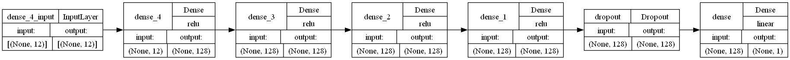

\newpage
# Abstract

United States has a significant problem of police brutality due to its societal implications, with fatal shootings  being a huge part of it. The aim of this project is to predict the number of shootings in each U.S state and which factor affects the number of shootings the most using machine learning. We used Decision Trees, Random Forest, Multiple Linear Regression (MLR), Artificial Neural Network (ANN) and XGBoost and compared their performances with one another. We concluded that Decision Trees is the best performing model to predict the number of shootings as it has the lowest mean squared error and mean absolute error.

# Context

Police brutality in the United States have garnered significant attention due to their profound societal implications. In 2022, the U.S. saw a record-high of at least 1,176 fatalities at the hands of law enforcement, with 24% of the victims being Black despite Black people only making up 13% of the population. (Levin, 2023) Furthermore, U.S. officers often evade legal consequences for such actions, benefiting from qualified immunity that shields them from lawsuits. (Cheatham & Maizland, 2022) This issue has sparked concerns about racial inequality, social justice and the need for enhanced police accountability. 

According to The Washington Post, the majority of police-involved deaths in the U.S., ranging from 65% to 95%, are the result of fatal shootings. (Shjarback, 2021) The ideal objective of the study would be to predict which police precinct has higher shooting rates and identify any patterns in the shooting cases. As most police departments in the US have limited manpower and resources (Berman, 2021), this can help them with effective resource allocation and management. While an accurate model can help policy makers look for characteristics of precincts with similar shooting rates, it can also help them identify precincts with fewer police shooting instances than predicted, potentially indicating that those precincts may have better training programs and policies that can be adapted to precincts with more shooting incidents. Furthermore, this can also contribute to the development of an early warning system to identify areas with higher risk of police brutality, so that agencies can intervene by providing preventive measures and additional training like de-escalation techniques, cultural sensitivity, and crisis intervention.

However, due to the lack of available information and the large scale of the objective, our study will instead focus on testing machine learning models on a smaller scale first. The 'police_shooting.csv' dataset will be analyzed, with the objective of predicting the annual number of shootings in each U.S. state. Subsequently, the results will be examined to assess the feasibility of the police applying the models on a broader scale with more information on their end.

```{r r global_options, include=FALSE, message=FALSE}
# the following command prevents all the R codes 
# from being included into the slides
knitr::opts_chunk$set(echo = FALSE, warning = FALSE, message = FALSE,
                      out.width = "100%", out.height = "70%",
                      fig.align='center')
library(tidyverse)
library(caret)
library(GGally)
```
\newpage
# Data Processing

In our final dataset, `police_shootings.csv`, we have joined 6 sets of
data by state and year. The dataset contains 408 observations and 15
features, which their descriptions can be found in the appendix.

```{r}
P <- read.csv("police_shooting.csv")
summary <- as.data.frame(t(summary(P)))

features = c("state", "year","high_sch_grads", "unemployment_percent", "total_labor_force", "total_checked_firearm", "white", "black", "american_indian_alaskan_native", "asian", "native_hawaiian_pacific_islander", "two_or_more_race
", "hispanic_latino", "population", "shooting_count_per_mil")

type <- rep(c(rep('categorical', 2), rep('numerical', 13)), times = 1)

# Create a summary statistics data frame
summary <- summary %>%
  separate(Freq, into = c("col2", "col3"), sep = "\\s*:\\s*", convert = TRUE) %>%
  pivot_wider(names_from = col2, values_from = col3) %>%
  mutate_all(~ ifelse(. == "NULL", "-", .)) %>%
  select(-'NA', -Var2, -Mode, -Length, -Class) %>%
  rename(Feature = Var1) %>%
  mutate(Feature = features, Type = type)
  
# summary <- summary %>% mutate
# colnames(data) <- NULL
knitr::kable(summary)
```

# Feature Engineering

When training our models, the variables `state` and `year` are not used as independent variables as neither the name of a state nor the numerical value of a year should directly affect the shooting count. Rather, the information of a certain state in a certain year are being represented by the other 12 variables, which can potentially have some correlations to the shooting count.

Further feature selection is also done through the use of L1 regularization in some of our models, such as Multiple Linear Regression and Artificial Neural Network. 

\newpage
# Exploratory Data Analysis

## Pairplots of numerical data

From the pairplots below, we can observe a few things:

1.  Shooting Count can be seen to have a slightly negative linear
    relationship with Unemployment Percentage and White population, and
    a positive linear relationship with black population, Two or more
    race population, and Hispanic Latino population.
2.  There are some features with high collinearity in the dataset, such
    as Asian Population and Native Hawaiian Pacific Islander Population.
3.  Focusing on Shooting Count, we can observe that it has a higher
    correlation to Percentage of High School Graduates, Total Checked
    Firearm, White Population, American Indian Alaskan Native
    Population, Asian Population, Native Hawaiian Pacific Islander
    Population, and Hispanic Latino Population.

```{r message=FALSE}
P %>% 
  setNames(c("state", "year", "sc", "hsg", "unem", "tlf", "tcf", "w", "b", 
                 "aian", "a", "nhpi", "tomr", "hl", "pop")) %>%
  select(-state, -year) %>%
    ggpairs(
    lower = list(continuous = wrap("points", size = 0.5)),
    diag = list(size = 1),
    upper = list(continuous = wrap("cor", size = 2)),
    axisLabels = "none"
  )
```

\newpage

## Bar graph of difference in shooting counts between 2015 and 2022

From the bar graph below, it can be observed that in general, there are
more cases of police shootings in 2022 than 2015 in each state.

```{r fig.height=4, fig.width=6}
filtered_data <- subset(P, year %in% c(2015, 2022))
difference_data <- filtered_data %>%
  group_by(state) %>%
  summarise(difference = shootings_count_per_mil[year == 2022] - shootings_count_per_mil[year == 2015])

ggplot(difference_data, aes(x = state, y = difference)) +
  geom_bar(stat = "identity") +
  labs(title = "Difference in Shooting Count (2015 to 2022)", x = "State", y = "Shooting Count Difference") +
  scale_fill_manual(values = c("red", "blue"), labels = c("Decrease", "Increase")) +
  theme(axis.text.x = element_text(angle = 90, hjust = 1))
```

\newpage
## Shooting Count by State

From the boxplots below, it can be observed that New Mexico has the
highest average number of police shooting cases while Connecticut has
the lowest. We can also see that the number of police shooting cases
varies the most in Wyoming, while the number of police shooing cases
remains roughly the same in New York.

```{r}
# avg_counts <- aggregate(shootings_count_per_mil ~ state, P, mean)

# Create a bar graph
ggplot(P, aes(x = state, y = shootings_count_per_mil)) +
  geom_boxplot() +
  labs(title = "Shooting Count by State", x = "State", y = "Shooting Count") +
  theme(axis.text.x = element_text(angle = 90, hjust = 1))
```

\newpage

# Methodology

## Decision Trees

We will train two models, decision tree and random forest, to predict the number of police shootings.

First, the data is processed, 70% is used as the training set, and 30% is used as the test set.
```{r}
library(shapr)
library(dplyr)
library(rpart.plot)
library(caret)
library(ranger)
set.seed(1234)

data <- read.csv("police_shooting.csv")
data <- data %>% select(-state ,-year)

train <- sample(nrow(data), nrow(data)*0.7)
data_train <- data[train, ]
data_test <- data[-train, ]
```
Then we train a decision tree model and plot it out:

```{r}
categorical_vars <- c("high_sch_grads", "unemployment_percent", "total_labor_force",
"total_checked_firearm", "white", "black", "american_indian_alaskan_native", "asian", 
"native_hawaiian_pacific_islander", "two_or_more_race", "hispanic_latino", "population")

categorical_data_frame <- data.frame(Columns = categorical_vars)

tree_model <- rpart(shootings_count_per_mil~., data = data)
```
```{r}
rpart.plot(tree_model)
```
To prune a decision tree, we first grow it and then we choose a sub-tree minimizing the regularized loss function
$$
\sum_{m=1}^{|T|}\sum_{x^{i}\in R_m}(y^{i}-\hat{y}_{R_i})^2
+\alpha|T|
$$
Below is the plot of cross-validation error vs $\alpha$ (parameter `cp`):
```{r}
plotcp(tree_model)
```

First, we will look at the table
```{r}
knitr::kable(tree_model$cptable)
```
We then found the optimal value of $\alpha = 0.01$ and pruned the tree.
```{r}
opt_cp <- tree_model$cptable[which.min(tree_model$cptable[ , 'xerror']) , 'CP']
#knitr::kable(opt_cp)
alpha <- data.frame(alpha = opt_cp)
```
```{r}
tree_model_pruned <- prune.rpart(tree_model, opt_cp)
```
Variable importance is measured as a total drop in residual sum of squares due to splits in each variable. Here is how we calculate it with the function `varImp` from `caret`:
```{r warning=FALSE}
Var_importance <- varImp(tree_model_pruned) %>%
  arrange(-Overall) %>%
  head(n = 12)

Var_imp <- data.frame(Var_importance = Var_importance)
knitr::kable(head(Var_imp), row.names = TRUE)
```

And here is how we can extract it directly from the model:
```{r}
var_imp <- data.frame(Var_importance = tree_model_pruned$variable.importance)
knitr::kable(head(var_imp), row.names = TRUE)
```

Finally, let us construct predictions and report the test RMSE
and MAE error calculated in `caret‘
```{r}
RMSE <- tree_model %>%
  predict(data_test) %>%
  RMSE(data_test$shootings_count_per_mil)

MAE <- tree_model %>%
  predict(data_test) %>%
  MAE(data_test$shootings_count_per_mil)

score_df <- data.frame(RMSE = RMSE, MAE = MAE)
knitr::kable(t(score_df))
```
Now, we build and train a random forest model. Here we set train control to `oob`:
```{r}
#random forest
library(randomForest)
set.seed(1234)
```
```{r}
mod_rf <- train(shootings_count_per_mil ~ . , data = data_train, method = "ranger",
    num.trees = 50,
    importance = 'impurity',
    trControl = trainControl("oob"))

```
Let us construct predictions and report the test RMSE and MAE error calculated in `caret‘
```{r warning=FALSE}
RMSE <- mod_rf %>%
  predict(data_test) %>%
  RMSE(data_test$shootings_count_per_mil)

MAE <- mod_rf %>%
  predict(data_test) %>%
  MAE(data_test$shootings_count_per_mil)

score_df <- data.frame(RMSE = RMSE, MAE = MAE)
knitr::kable(t(score_df))
```


The top 10 most important variables using Random Forest are:
```{r}
var_importance <- mod_rf$finalModel$variable.importance %>%
  sort(decreasing = TRUE)

var_imp <- data.frame(Var_importance = var_importance %>% head(10))
knitr::kable(head(var_imp), row.names = TRUE)
```
Here is the a plot of variable importance:
```{r}
var_importance <- mod_rf$finalModel$variable.importance %>%
  sort(decreasing = TRUE) %>% head(10)

data.frame(variable = names(var_importance),
            importance = var_importance) %>%
  mutate(word = gsub("w_", "", variable)) %>%
  ggplot(aes(x = reorder(word, -importance), y = importance)) +
  geom_col() + xlab("variables") + ylab("importance") +
  theme(axis.text.x = element_text(angle = 45))
```

\newpage
## Multiple linear regression (MLR)

```{r}
library(dplyr) 
library(ggplot2)
library(Metrics)
library(glmnet)
library(stargazer)
library(knitr)
```

Multiple linear regression (MLR) is used to fit the data to a linear equation, 
$$Y = β_0 + β_1X_1 + β_2X_2 + ... + β_nX_n + ε$$, 
where $Y$ is the dependent variable and $X_n$ are the independent variables.
This equation is then used to predict the value of the shootings_count_per_mil based on the values of the independent variables.

Before applying the MLR model, the data is split into a training set and a test set with a 70/30 ratio. 

```{r}
x <- read.csv('police_shooting.csv')
set.seed(100)

# Split the data into training and testing sets
ind <- runif(nrow(x)) < 0.7
train_data <- x[ind, ]
test_data <- x[!ind, ]

```

Firstly, the train_data will be fitted into the MLR model to find the coefficients to the linear equation that best fit the data. Then, the MLR model will be used to predict the shootings_count_per_mil in the test_data.  

```{r}
MLR <- lm(shootings_count_per_mil ~ high_sch_grads + unemployment_percent 
          + total_checked_firearm + white + black +	american_indian_alaskan_native 
          + asian + native_hawaiian_pacific_islander + two_or_more_race 
          + hispanic_latino, data = train_data)

stargazer(MLR, type = "text", digits = 3, single.row = TRUE)

predictions <- predict(MLR, newdata = test_data)
```

From the summary table, we can see that there are a few insignificant variables. However, due to the lack of other information, we did not remove those variables.

So, to further evaluate the accuracy of the MLR model in predicting the shootings_count in the test_data, a "predicted values vs the actual values" scatter plot with a best fit line is created to visualize the results.

```{r}
plot_data <- data.frame(Actual = test_data$shootings_count_per_mil, 
                        Predicted = predictions)
ggplot(plot_data, aes(x = Actual, y = Predicted)) + geom_point() + 
  geom_abline(intercept = 0, slope = 1, color = "red", linetype = "dashed") +
  labs(x = "Actual Values", y = "Predicted Values", 
       title = "MLR Regression: Predicted vs Actual")
```

Based on the scatter plot, the points generally follow a linear trend, however a few outliers can be observed. The outliers could have been due to more extreme circumstances that is not taken into account by the MLR model. Thus, we identified the 10 outliers by calculating the residuals.

```{r}
# Calculate residuals
residuals <- test_data$shootings_count_per_mil - predictions

# Identify outliers
outliers <- which(abs(residuals) > 1.5 * sd(residuals))
outliers_table <- test_data[outliers, ]
outliers_table$Predicted_Value <- predictions[outliers]
outliers_table$Residual <- residuals[outliers]

#Split table
part1 <- t(outliers_table)[, 1:5]
part2 <- t(outliers_table)[, 6:10]

kable(part1, format = "markdown")
kable(part2, format = "markdown")
```

A noteworthy observation is Rhode Island in 2020, where the shootings_per_mil is lower than the predicted value. This discrepancy may suggest the implementation of effective policies in the region.
Otherwise, to understand why the shootings_per_mil are higher than predicted shootings for the other outliers, policymakers can conduct further research by employing additional information in hopes of identifying any trends within these outliers.
	
Furthermore, to improve the accuracy of the MLR predictions, we made use of LASSO regression to regularize the data.

```{r}
# Fit a LASSO regression model
lasso <- cv.glmnet(as.matrix(train_data[, -c(1,2,15)]), 
                   train_data$shootings_count_per_mil, alpha = 1)

best_lambda <- lasso$lambda.min

lasso_cv <- glmnet(as.matrix(train_data[, -c(1,2,15)]), 
                   train_data$shootings_count_per_mil, alpha = 1, lambda = best_lambda)

lasso_predictions <- predict(lasso_cv, newx = as.matrix(test_data[, -c(1,2,15)]))
```

Next, Mean Absolute Error (MAE), Root Mean Squared Error (RMSE) and R-Squared are computed to compare the accuracy of both models.

```{r}
mae_value <- mae(test_data$shootings_count_per_mil, predictions)
mse_value <- mse(test_data$shootings_count_per_mil, predictions)
rmse_value <- rmse(test_data$shootings_count_per_mil, predictions)
r_squared_value <- cor(test_data$shootings_count_per_mil, predictions)^2

lasso_mae_value <- mae(test_data$shootings_count_per_mil, 
                     lasso_predictions)
lasso_mse_value <- mse(test_data$shootings_count_per_mil, 
                     lasso_predictions)
lasso_rmse_value <- rmse(test_data$shootings_count_per_mil, 
                       lasso_predictions)
lasso_r_squared_value <- cor(test_data$shootings_count_per_mil, 
                           lasso_predictions)^2

evaluation_table <- data.frame(
  Model = c("MLR", "LASSO"),
  MAE = c(mae_value, lasso_mae_value),
  MSE = c(mse_value, lasso_mse_value),
  RMSE = c(rmse_value, lasso_rmse_value),
  R_squared = c(r_squared_value, lasso_r_squared_value)
)

kable(evaluation_table, format = "markdown")
```
Based on the evaluation table, LASSO regression provides slightly more accurate predictions than MLR. Although both models may not be very accurate, MLR can still be useful for investigating the outliers.      

\newpage
## Artificial Neural Network

We will be training a Feedforward Neural Network to predict the number
of police shootings.

```{r}
library(tidyverse) # for manipulation with data
library(caret) # for machine learning, including KNN
library(keras) # for artificial neural networks

P <- read.csv('police_shooting.csv') %>% select(-state, -year)
```

Before training the model, the dataset has to be preprocessed. The
dataset is first split into train, test and validation set with a 60/20/20
ratio. The sets are then separated into feature sets ($train\_X$,
$test\_X$, $val\_X$) and response variable sets ($train\_y$, $test\_y$,
$val\_y$). We then normalized them with $$
x\mapsto
\frac{x - m}{M - m},
$$ where $m$ and $M$ are the minimum and the maximum of $x$ in the
respective datasets.

The dimensions of the datasets are as follows:

```{r warning=FALSE}
set.seed(1234)

idx <- sample(seq(1, 3), size = nrow(P), replace = TRUE, prob = c(.6, .2, .2))
train_data <- P[idx == 1,]
test_data <- P[idx == 2,]
val_data <- P[idx == 3,]

train_y <- train_data$shootings_count_per_mil %>% as.matrix()
val_y <- val_data$shootings_count_per_mil %>% as.matrix()
test_y <- test_data$shootings_count_per_mil %>% as.matrix()

predictor_variables <- train_data %>% select(-c("shootings_count_per_mil"))
preprocess_params <- preProcess(predictor_variables, method = c("range"))
normalized_predictors <- predict(preprocess_params, predictor_variables)
train_X <- cbind(normalized_predictors) %>% as.matrix()

predictor_variables <- test_data %>% select(-c("shootings_count_per_mil"))
preprocess_params <- preProcess(predictor_variables, method = c("range"))
normalized_predictors <- predict(preprocess_params, predictor_variables)
test_X <- cbind(normalized_predictors) %>% as.matrix()

predictor_variables <- val_data %>% select(-c("shootings_count_per_mil"))
preprocess_params <- preProcess(predictor_variables, method = c("range"))
normalized_predictors <- predict(preprocess_params, predictor_variables)
val_X <- cbind(normalized_predictors) %>% as.matrix()

dimensions_df <- data.frame(
  Dataset = c("train_X", "train_y", "test_X", "test_y", "val_X", "val_y"),
  Rows = c(dim(train_X)[1], dim(train_y)[1], dim(test_X)[1], dim(test_y)[1], dim(val_X)[1], dim(val_y)[1]),
  Columns = c(dim(train_X)[2], dim(train_y)[2], dim(test_X)[2], dim(test_y)[2], dim(val_X)[2], dim(val_y)[2])
)
knitr::kable(dimensions_df)
```

Our model uses `MSE` as the loss function, `adam` as the optimizer, and
`MAE` as a metric. On experimenting with different widths (16, 32, 64,
128) and different depths (1, 2, 3, 4) several times, it is observed
that different width size performs equally well with similar MSE and MAE
values while deeper models give better predictions. Thus, our final
model consists of 4 hidden layers with 128 units.

The architecture of our network is as follows:

-   Input Layer: Input size of 12, regularized using L1 regularization
    with a regularization parameter of 0.005.

-   Hidden Layer: A Dense layer with 128 units and ReLU activation
    function.

-   Dropout Layer: A dropout layer with a dropout rate of 0.05.

-   Output Layer: A Dense layer with 1 unit and Linear activation
    function.

```{r warning=FALSE}
mod_nn <- keras_model_sequential() 

mod_nn <- mod_nn %>%
    layer_dense(units = 128, activation = 'relu', kernel_regularizer = regularizer_l1(0.005), input_shape = ncol(train_X)) %>%
    layer_dense(units = 128, activation = "relu") %>%
    layer_dense(units = 128, activation = "relu") %>%
    layer_dense(units = 128, activation = "relu") %>%
    layer_dropout(rate = 0.05) %>%
    layer_dense(units = 1, activation = "linear")

mod_nn %>% compile(
  loss = "mse",
  optimizer = 'adam',
  metrics = list("mean_absolute_error"))

# Visualize the neural network
plot(mod_nn, show_shapes = TRUE, show_layer_names = TRUE, rankdir = "LR", show_layer_activations = TRUE, to_file="model.png")
```



The model will be fitted with the train and validation set and trained
with 50 epochs. However, too much training will cause the model to
overfit, resulting in poor performance on the test set. Hence, we
implemented early stopping with $patience = 5$, where the training stops
when the validation loss does not improve for 5 iterations in a row.

```{r}
early_stopping <- callback_early_stopping(monitor = "val_loss", patience = 5)

history = fit(mod_nn, train_X, train_y, epochs = 50, verbose = 0, 
              validation_data = list(val_X, val_y), callbacks = list(early_stopping))
plot(history)
```

The metrics MSE and MAE are used to verify the performance of the model. On training, we found that

-   MSE $\approx$ 2.8: The average squared difference between the
    predicted and actual values = 2.8.

-   MAE $\approx$ 1.1: On average, the model's predictions are off by
    approximately 1.1 unit.

```{r include=FALSE, message=FALSE}
set.seed(1234)
# Compute predictions
predictions <- predict(mod_nn, test_X)

# Compute MSE and MAE
score <- mod_nn %>% evaluate(test_X, test_y, verbose = 0)
```

```{r}
set.seed(1234)
score_df <- data.frame(MSE = score[[1]], MAE = score[[2]])
knitr::kable(t(score_df))
```

A table of the actual shooting count against the predicted shooting
count is also shown below.

```{r}
# Create a data frame to compare Actual and Predicted values
results <- data.frame(Actual = as.vector(test_y), Predicted = predictions)
knitr::kable(head(results), row.names = FALSE)
```

The model is observed to perform well in the state level with only 408
observations, thus it can be expected to perform even better at the
police precinct level, where there will be more data. However, as
experiments are only done on the width and depth, more hyperparameters,
such as optimizer, learning rate, dropout rate, can be tuned to achieve
a more accurate model.

\newpage
## XGBoost
XGBoost (Extreme Gradient Boosting) is a type of ensemble learning method, which is a machine learning technique that combine the predictions from multiple models to improve the overall performance. In gradient boosting, decision trees are created in a sequential form and these subsequent trees will reduce the errors of the previous tree by learning from them. Weights are assigned to the independent predictors then they are fed into the decision tree. The weight of variables increase or decrease depending on the performance of the decision tree, which affects the residuals of the tree. The subsequent trees are then fitted according to the residuals of the previous trees and reduce their errors by learning from them. These trees are then ensembled to combine their predictive power, giving a stronger and more precise model. XGBoost is a more optimized version of gradient boosting.

```{=tex}
\begin{center}

\includegraphics[height=4cm]{xgboost.png}

\end{center}
```

The objective function at iteration t that we need to minimize is the following:
$$
 L^{(t)}= \sum_{x = 1}^{n}l(y_i,\hat{y}^{(t-1)}+f_t(\mathbf{x}_i))+
 \Omega(f_t)
$$
where, $\Omega(f_t)$ = $\gamma T$ + $\frac{1}{2}\lambda\sum_{j = 1}^{T}w_j^2$.
 
$l$ is the loss function that measures the difference between prediction $\hat{y}$ and actual value $y_i$ while $\Omega(f_t)$ is the regularization part of the function, penalizing the model's complexity. In the $\Omega(f_t)$ function, L1 regularization is controlled by $\gamma$ while L2 regularization is controlled by $\lambda$. $\hat{y}^{(t-1)}$ denotes the prediction result for sample $i$ after the $t^{th}$ iteration. $f_t(\mathbf{x}_i)$ represents the $t^{th}$ tree model. 

Compared to normal gradient boosting, XGBoost uses L1 and L2 regularization techniques to prevent overfitting and has built-in functionality to handle missing values, whereas gradient boosting require explicit imputation of missing values. It is also faster than gradient boosting as it includes several optimization techniques.

Hyper parameters of XGBoost:

-   objective: specify the learning task and the corresponding learning
    objective. In this case, we used regression with squared loss.

-   learning_rate: controls the shrinkage of each tree's contribution to
    prevent overfitting

-   subsample: Denotes the fraction of observations to be random samples
    for each tree. Used to control overfitting.

-   colsample_bynode: the subsample ratio of columns for each node
    (split)

-   lambda: L2 regularization on weights

-   max_depth: maximum depth of a tree. Used to control overfitting.

```{r}
library(tidyverse)
library(caret)
library(Metrics)
library(xgboost)
library(DiagrammeR)

set.seed(1234)
P <- read.csv("police_shooting.csv")
P <- P %>% select(-c('year','state'))
y_var <- 'shootings_count_per_mil'
x_var <- c('high_sch_grads', 'unemployment_percent', 'total_labor_force', 'total_checked_firearm', 'white', 'black', 'american_indian_alaskan_native', 'asian', 'native_hawaiian_pacific_islander', 'two_or_more_race', 'hispanic_latino', 'population')
P$state <- unclass(P$state)
sample <- sample(1:nrow(P), nrow(P)*0.70)
train <- P[sample,]
test <- P[-sample,]

#Convert training and test set to xgb.DMatrix format
#define predictor and response variables in training set
train_x = data.matrix(train[, x_var])
train_y = train[, y_var]

#define predictor and response variables in testing set
test_x = data.matrix(test[, x_var])
test_y = test[, y_var]

xgb_train = xgb.DMatrix(data = train_x, label = train_y)
xgb_test = xgb.DMatrix(data = test_x, label = test_y)

```

Firstly, we split the data into train and test with a 70/30 ratio. We then fit a XGBoost model to the data:
```{r results='hide'}
params <- list(
  objective = "reg:squarederror",
  learning_rate = 0.05,
  subsample = 0.9,
  colsample_bynode = 1,
  lambda = 2,
  max_depth = 5
)

fit_xgb <- xgb.train(
  params,
  data = xgb_train,
  watchlist = list(valid = xgb_test),
  early_stopping_rounds = 20,
  print_every_n = 100,
  nrounds = 55,
)
```
```{r}
model_info <- data.frame(
  "Parameters" = fit_xgb$params,
  "Number of Features" = length(fit_xgb$feature_names),
  "Number of Iterations" = fit_xgb$niter,
  "Best Iteration" = fit_xgb$best_iteration,
  "Best Ntreelimit" = fit_xgb$best_ntreelimit,
  "Best Score" = fit_xgb$best_score,
  "Best Message" = fit_xgb$best_msg,
  "Number of Features Used" = length(fit_xgb$feature_names)
)
kable(t(model_info))
```

XGBoost has a built-in feature importance function, which allows us to carry out feature selection by finding out the feature importance values for all variables. Hence, we find the feature importance for each variable and plot them out:
```{r}
var_imp = xgb.importance(
            feature_names = colnames(xgb_train),
            model = fit_xgb)
 
# Importance plot
xgb.plot.importance(var_imp)
 
```
From the variable importance model, the AMERICAN_INDIAN_ALASKAN_NATIVE variable is the most important, followed by the NATIVE_HAWAIIAN_PACIFIC_ISLAND and TOTAL_LABOR_FORCE variable. This suggests that the race of the population, specifically American Indian Alaskan Natives, significantly affect the number of shootings for the XGBoost model. We now find the error for the XGBoost model:
```{r}
y_pred <- predict(fit_xgb, test_x)
MAE <- mae(test_y, y_pred)
MSE <- mean((test_y - y_pred)^2)

error_df <- data.frame(MSE = MSE, MAE = MAE)
knitr::kable(t(error_df))
```

\newpage
# Conclusion

We have introduced 5 models (Decision tree, Random Forest, Multiple Linear Regression, Artificial Neural Network and XGBoost) to predict in police shooting rates across U.S. precinct and identifying patterns to help with resource deployment to control of shootings. 

According to the Decision Tree and Random Forest models, we can know that the most important variable is AMERICAN_INDIAN_ALASKAN_NATIVE. Our Multiple Linear Regression model is regularized with LASSO, which gave a better performance as compared to vanilla linear regression. In the Artificial Neural Network model, it appears that every width size performs equally well with similar MSE and MAE values, while deeper models perform better with lower MSE and MAE values. Finally, for XGBoost, the most important variable is also AMERICAN_INDIAN_ALASKAN_NATIVE. While XGBoost has regularization techniques to prevent overfitting and is an efficient model, it is a 'black box' algorithm that is difficult to interpret.

```{r}

my_data <- data.frame(
  Name = c("Model", "MSE", "MAE"),
  Score1 = c("Artificial Neural Network", 2.827200 , 1.133631),
  Score2 = c("XGBoost", 4.167986, 1.151542),
  Score3 = c("Decision Tree", 2.328917, 0.9802309),
  Score4 = c("Random Forest", 3.705386, 1.14077),
  Score5 = c("MLR", 3.460447, 1.114836)
)

knitr::kable(t(my_data), row.names = FALSE)
```
As shown in the table above, we can know that among all 5 models, Decision Tree has the highest accuracy and the smallest MSE and MAE.

In conclusion, our exploration into predicting police shooting rates in U.S. using various machine learning models has provided valuable insights. The predictive capabilities demonstrated by our models, particularly the Decision Tree model with its highest accuracy, lay the groundwork for future endeavors. As we navigate the complex landscape of law enforcement and social justice, the insights gained from this study can contribute to informed decision-making, resource allocation, and policy formulation.

In essence, our analysis serves as a testament to the potential of machine learning in shedding light on critical societal issues. While acknowledging the complexities involved, our findings encourage further research and collaboration between data scientists, policymakers, and law enforcement agencies to foster a more just and equitable society.


\newpage
# References

Cheatham, A., & Maizland, L. (2022, March 29). What Are Police Like in
Other Countries? Council on Foreign Relations. Retrieved November 19,
2023, from
<https://www.cfr.org/backgrounder/how-police-compare-different-democracies>

Levin, S. (2023, January 6). 'It never stops': killings by US police
reach record high in 2022. The Guardian. Retrieved November 19, 2023,
from
<https://www.theguardian.com/us-news/2023/jan/06/us-police-killings-record-number-2022>

Shjarback, J. (2021, November 11). Lack of data on nonfatal police
shootings hurts understanding of police use of force. The Washington
Post. Retrieved November 19, 2023, from
<https://www.washingtonpost.com/crime-law/2021/11/11/non-fatal-police-shootings-disparities-data/>

Berman, M. (2021, May 8). Most police departments in America are small. that’s partly why changing policing is difficult, experts say. The Washington Post. Retrieved November 21, 2023 from <https://www.washingtonpost.com/nation/2021/05/08/most-police-departments-america-are-small-thats-partly-why-changing-policing-is-difficult-experts-say/>

# Appendix

## List of datasets combined

1.  `fatal-police-shootings-data.csv`: Records death-related information
    about each incident and victim. This dataset is aggregated to obtain
    the total number of shootings in each US state from 2015 to 2022.
    The state abbreviations are renamed to their full form for ease of
    data joining in the later parts. To ensure that there are values for
    every state from 2015-2022, data of states with no data in a
    particular year are generated with `shootings_count` = 0.

```{r}
df <- read_csv("raw_data/fatal-police-shootings-data.csv")

# Used for renaming states
state_abbreviations <- data.frame(
  state = c(
    "Alabama", "Alaska", "Arizona", "Arkansas", "California", "Colorado",
    "Connecticut", "Delaware", "District of Columbia","Florida", "Georgia", "Hawaii", "Idaho",
    "Illinois", "Indiana", "Iowa", "Kansas", "Kentucky", "Louisiana",
    "Maine", "Maryland", "Massachusetts", "Michigan", "Minnesota",
    "Mississippi", "Missouri", "Montana", "Nebraska", "Nevada", "New Hampshire",
    "New Jersey", "New Mexico", "New York", "North Carolina", "North Dakota",
    "Ohio", "Oklahoma", "Oregon", "Pennsylvania", "Rhode Island", "South Carolina",
    "South Dakota", "Tennessee", "Texas", "Utah", "Vermont", "Virginia",
    "Washington", "West Virginia", "Wisconsin", "Wyoming"
  ),
  state_abbr = c(
    "AL", "AK", "AZ", "AR", "CA", "CO", "CT", "DE", "DC", "FL", "GA", "HI",
    "ID", "IL", "IN", "IA", "KS", "KY", "LA", "ME", "MD", "MA", "MI", "MN",
    "MS", "MO", "MT", "NE", "NV", "NH", "NJ", "NM", "NY", "NC", "ND", "OH",
    "OK", "OR", "PA", "RI", "SC", "SD", "TN", "TX", "UT", "VT", "VA", "WA",
    "WV", "WI", "WY"
  )
)

# Aggregating by state and by year + rename state
df1 <- df %>%
  mutate(date = as.Date(date),
         year = format(date, "%Y"),
         month = format(date, "%m")) %>%
  aggregate(id ~ (state + year), FUN = length) %>%
  filter(year != "2023") %>%
  mutate(year = as.numeric(year)) %>%
  left_join(state_abbreviations, by = c("state" = "state_abbr")) %>%
  select(-state) %>%
  rename("state" = "state.y", "shootings_count" = "id")

# Ensure dataset has values for every state from 2015-2022
all_states <- unique(df1$state)
all_years <- 2015:2022
all_combinations <- expand.grid(state = all_states, year = all_years)

# Merge the new data frame with the existing data frame and fill missing values with 0
df1 <- all_combinations %>%
  left_join(df1, by = c("state", "year")) %>%
  replace(is.na(.), 0) %>%
  arrange(state)
```

2.  `high_school_grads.csv`: Records the number of people whose highest
    qualification is high school in each US state from 1980 to 2026
    (projected). The state abbreviations are renamed to their full form
    for ease of data joining in the later parts, and only data from
    2015-2022 are selected. The dataset is also converted to a long
    data, where columns of 2015-2022 are converted to a single column
    ,`year`. The values are made into a new column, `high_sch_grads`.

```{r}
df2 <- read_csv("raw_data/high_school_grads.csv")

# Used for renaming states
states = c(
    "Alabama", "Alaska", "Arizona", "Arkansas", "California", "Colorado", "Connecticut", "Delaware",
    "District of Columbia", "Florida", "Georgia", "Hawaii", "Idaho", "Illinois", "Indiana",
    "Iowa", "Kansas", "Kentucky", "Louisiana", "Maine", "Maryland", "Massachusetts",
    "Michigan", "Minnesota", "Mississippi", "Missouri", "Montana", "Nebraska", "Nevada", "New Hampshire",
    "New Jersey", "New Mexico", "New York", "North Carolina", "North Dakota", "Ohio", "Oklahoma", "Oregon",
    "Pennsylvania", "Rhode Island", "South Carolina", "South Dakota", "Tennessee", "Texas",
    "Utah", "Vermont", "Virginia", "Washington", "West Virginia", "Wisconsin", "Wyoming"
  )

# Convert to long data and select data from 2015-2022
df2 <- df2 %>%
  mutate(state = states) %>%
  select(-State) %>%
  rename_at(vars(-1), ~gsub("(\\d{4}).*", "\\1", .)) %>%
  pivot_longer(cols = -state,
               names_to = "year",
               values_to = "high_sch_grads") %>%
  filter(year >= 2015 & year <= 2022)

# Merge with main dataset
result_df <- merge(df1, df2, by = c("state","year"))
```

3.  `unemployment.csv`: Records the labour force, employment and
    unemployment rates in each US state from 1976 to 2022. Only data
    from 2015-2022, the unemployment percentage and total labor force
    are selected as features.

```{r}
df3 <- read.csv("raw_data/unemployment.csv")

# Select data from 2015-2022
df3 <- df3 %>%
  filter(month == 1 & year >= 2015 & year <= 2022) %>%
  select(c("state", "year", "Unemployment..", "Civilian.labor.force.Total")) %>%
  rename("unemployment_percent" = "Unemployment..", "total_labor_force" = "Civilian.labor.force.Total") %>%
  mutate(total_labor_force = total_labor_force %>% gsub(",", "", .) %>% as.numeric)

# Merge with main dataset
result_df <- merge(result_df, df3, by = c("state","year"))
```

4.  `nics-firearm-background-checks.csv`: Records the number of checked
    firearms in each US state from 1998 to 2023. This dataset is
    aggregated to obtain the total number of firearms in each US state
    from 2015 to 2022.

```{r}
df4 <- read.csv("raw_data/nics-firearm-background-checks.csv")

# Aggregating by state and by year
df4 <- df4 %>%
  select(month, state, totals)%>%
  mutate(month = as.Date(paste0(month, "-01"), format = "%Y-%m-%d"),
         year = format(month, "%Y"),
         month = format(month, "%m")) %>%
  group_by(year, state) %>%
  summarize(total_checked_firearm = sum(totals)) %>%
  filter(year >= 2015 & year <= 2022)

# Merge with main dataset
result_df <- merge(result_df, df4, by = c("state","year"))
```

5.  `race_population.csv`: Records the population of the races in each
    US state from 2000 to 2022. The races include: White, Black,
    American Indian and Alaskan Native, Asian, Native Hawaiian and Other
    Pacific Islander, Two or More Race Groups, and Hispanic or Latino.
    This dataset is converted to a wide data, where the value of the
    races are converted to columns.

```{r}
df5 <- read.csv("raw_data/race_population.csv")

# Convert to wide data and select data from 2015-2022
df5 <- df5 %>%
  filter(LocationType != "Nation" & DataFormat == 'Number') %>%
  select(-c(LocationType, DataFormat)) %>%
  rename('year' = 'TimeFrame', 'state' = 'Location') %>%
  pivot_wider(names_from = Race, values_from = Data) %>%
  select(-"Total Ages 18 and Over") %>%
  setNames(c('state', 'year', 'white', 'black',
             'american_indian_alaskan_native', 'asian',
             'native_hawaiian_pacific_islander', 'two_or_more_race',
             'hispanic_latino')) %>%
  filter(year >= 2015 & year <= 2022)

# Merge with main dataset
result_df <- merge(result_df, df5, by = c("state","year"))
```

6.  `population_usa.csv`: Records the population of each US state from
    1900 to 2022. This dataset is converted to a long data, where
    columns of 2015-2022 are converted to a single column ,`year`. The
    values are made into a new column, `population`.

```{r}
df6 <- read.csv('raw_data/population_usa.csv')

# Convert to long data and select data from 2015-2022
df6 <- df6 %>%
  select(State, X2015, X2016, X2017, X2018, X2019, X2020, X2021, X2022) %>%
  setNames(c("state", 2015:2022)) %>%
  mutate(state = states) %>%
  pivot_longer(cols = -state,
               names_to = "year",
               values_to = "population")

# Merge with main dataset
result_df <-result_df %>%
  merge(df6, by = c("state","year")) %>%
  mutate(across(-state, as.numeric))
```

```{r}
result_df <- result_df %>%
  mutate(across(c("shootings_count", "high_sch_grads", "total_labor_force", "total_checked_firearm", "white", "black", "american_indian_alaskan_native", "asian", "native_hawaiian_pacific_islander", "two_or_more_race","hispanic_latino"), ~.*100/population)) %>%
  mutate(shootings_count_per_mil = shootings_count * 10000) %>%
  select(-shootings_count)
# write.csv(result_df, "police_shooting.csv", row.names = FALSE)
```

## Description of Features

```{r}
desc_df <- data.frame(
  Feature = c("state", "year","high_sch_grads", "unemployment_percent", "total_labor_force", "total_checked_firearm", "white", "black", "american_indian_alaskan_native", "asian", "native_hawaiian_pacific_islander", "two_or_more_race
", "hispanic_latino", "population", "shooting_count_per_mil"),
  Description = c("A state in US", "Year", "% of people whose highest qualification is high school", "% of unemployed people", "% Population of Labour Force", "Total # of checked firearms", "% Population", "% Population", "% Population", "% Population", "% Population", "% Population", "% Population", "Total population", "# of police shootings per 1 million people")
)

knitr::kable(desc_df)
```

## Width and Depth Experiments

```{r results='hide'}
set.seed(10)
P <- read.csv('police_shooting.csv')
P$state <- as.factor(P$state)
P$year <- as.factor(P$year)

dummy_transformer <- dummyVars(" ~ .", data = P, levelsOnly = TRUE)
P <- data.frame(predict(dummy_transformer, newdata = P))

idx <- sample(seq(1, 3), size = nrow(P), replace = TRUE, prob = c(.6, .2, .2))
train_data <- P[idx == 1,]
test_data <- P[idx == 2,]
val_data <- P[idx == 3,]

train_y <- train_data$shootings_count_per_mil %>% as.matrix()
val_y <- val_data$shootings_count_per_mil %>% as.matrix()
test_y <- test_data$shootings_count_per_mil %>% as.matrix()

predictor_variables <- train_data %>% select(-c("shootings_count_per_mil"))
preprocess_params <- preProcess(predictor_variables, method = c("range"))
normalized_predictors <- predict(preprocess_params, predictor_variables)
train_X <- cbind(normalized_predictors) %>% as.matrix()

predictor_variables <- test_data %>% select(-c("shootings_count_per_mil"))
preprocess_params <- preProcess(predictor_variables, method = c("range"))
normalized_predictors <- predict(preprocess_params, predictor_variables)
test_X <- cbind(normalized_predictors) %>% as.matrix()

predictor_variables <- val_data %>% select(-c("shootings_count_per_mil"))
preprocess_params <- preProcess(predictor_variables, method = c("range"))
normalized_predictors <- predict(preprocess_params, predictor_variables)
val_X <- cbind(normalized_predictors) %>% as.matrix()

build_and_evaluate_model_width <- function(depth, width, train_X, train_y, val_X, val_y, test_X, test_y) {
  
  mod_nn <- keras_model_sequential()
  
  if(depth == 1) {
    mod_nn <- mod_nn %>%
    layer_dense(units = 16, activation = 'relu', kernel_regularizer = regularizer_l1(0.005), input_shape = ncol(train_X)) %>%
    layer_dropout(rate = 0.05) %>%
    layer_dense(units = 1, activation = "linear")
  } else if(depth == 2) {
    mod_nn <- mod_nn %>%
    layer_dense(units = 16, activation = 'relu', kernel_regularizer = regularizer_l1(0.005), input_shape = ncol(train_X)) %>%
    layer_dense(units = 16, activation = "relu") %>%
    layer_dropout(rate = 0.05) %>%
    layer_dense(units = 1, activation = "linear")
  } else if(depth == 3) {
    mod_nn <- mod_nn %>%
    layer_dense(units = 16, activation = 'relu', kernel_regularizer = regularizer_l1(0.005), input_shape = ncol(train_X)) %>%
    layer_dense(units = 16, activation = "relu") %>%
    layer_dense(units = 16, activation = "relu") %>%
    layer_dropout(rate = 0.05) %>%
    layer_dense(units = 1, activation = "linear")
  } else {
    mod_nn <- mod_nn %>%
    layer_dense(units = 16, activation = 'relu', kernel_regularizer = regularizer_l1(0.005), input_shape = ncol(train_X)) %>%
    layer_dense(units = 16, activation = "relu") %>%
    layer_dense(units = 16, activation = "relu") %>%
    layer_dense(units = 16, activation = "relu") %>%
    layer_dropout(rate = 0.05) %>%
    layer_dense(units = 1, activation = "linear")
  }

  mod_nn %>% compile(
    loss = "mse",
    optimizer = 'adam',
    metrics = list("mean_absolute_error")
  )

  early_stopping <- callback_early_stopping(monitor = "val_loss", patience = 5)

  history <- fit(mod_nn, train_X, train_y,
                 epochs = 150, validation_data = list(val_X, val_y),
                 callbacks = list(early_stopping), verbose = 0)

  predictions <- as.integer(predict(mod_nn, test_X))

  score <- mod_nn %>% evaluate(test_X, test_y, verbose = 0)
  mse <- score[[1]]
  mae <- score[[2]]


  return(list(Depth = depth, Width = width, MSE = mse, MAE = mae))
}

width <- c(16, 32, 64, 128)
depth <- c(1, 2, 3, 4)
result_matrix <- lapply(depth, function(d) {
  lapply(width, function(w) {
    result <- build_and_evaluate_model_width(
      depth = d,
      width = w,
      train_X = train_X,
      train_y = train_y,
      val_X = val_X,
      val_y = val_y,
      test_X = test_X,
      test_y = test_y
    )
    names(result) <- c("Depth", "Width", "MSE", "MAE")
    return(result)
  })
})
```

```{r}
result_df_depth_1 <- do.call(rbind.data.frame, lapply(result_matrix[[1]], function(x) do.call(cbind.data.frame, x)))
result_df_depth_2 <- do.call(rbind.data.frame, lapply(result_matrix[[2]], function(x) do.call(cbind.data.frame, x)))
result_df_depth_3 <- do.call(rbind.data.frame, lapply(result_matrix[[3]], function(x) do.call(cbind.data.frame, x)))
result_df_depth_4 <- do.call(rbind.data.frame, lapply(result_matrix[[4]], function(x) do.call(cbind.data.frame, x)))

merged_result_df <- merge(merge(result_df_depth_1, result_df_depth_2, by = c("Depth", "Width", "MAE", "MSE"), all = TRUE),
                          merge(result_df_depth_3, result_df_depth_4, by = c("Depth", "Width", "MAE", "MSE"), all = TRUE),
                          by = c("Depth", "Width", "MAE", "MSE"), all = TRUE)

knitr::kable(merged_result_df)
```
